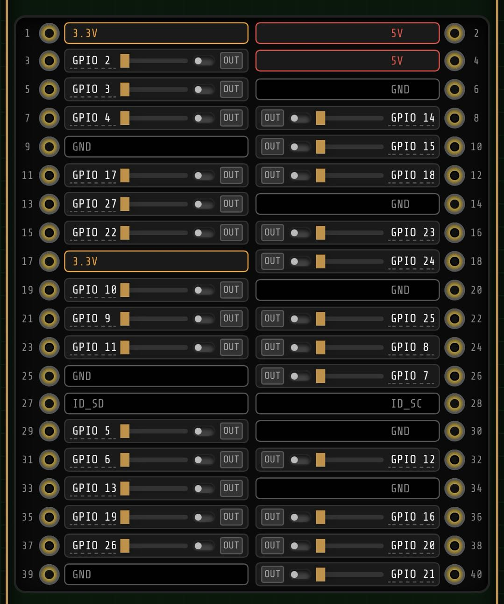

# ⚡ CyberPi GPIO Commander (赛博树莓派控制台)

> A cyberpunk-styled, highly advanced web interface for Raspberry Pi GPIO, PWM, and I2C telemetry.

CyberPi GPIO Commander 是一个针对树莓派 40Pin 引脚专门设计的极客风/赛博朋克风 Web 控制台。
它将物理硬件的原始控制力封装在一个充满工业设计感、动态反馈的手机端/桌面端完美适配的界面中。

## ✨ 核心特性 / Features

- **🔴 1:1 物理映射**：完全模拟树莓派 40Pin 真实主板物理走线与焊盘布局，指哪打哪，告别插错线的烦恼。
- **🔌 实时状态指示**：将绿色 LED 状态灯完美嵌套入金手指“物理焊盘”内，实时展现各个引脚的高低电平输出与 PWM 脉冲。
- **🌊 液态滑动条 (PWM)**：极致的空间利用率，无极滑动调节占空比，支持高精度调光与舵机控制。
- **📟 多通道逻辑分析仪 (Telemetry)**：内置终端动态捕获模式，支持波形输出和高频事件追踪。
- **🎛️ I2C 总线探针**：直接在 Web 端发起 I2C 硬件协议探测 (SCAN BUS)，支持底层读写寄存器操作，轻松驱动各类 OLED 屏幕、陀螺仪。
- **🎬 宏动作序列器 (Macro Sequencer)**：支持录制和回放一系列的 GPIO/PWM 动作，自动化硬件控制工作流。

## 📱 界面预览 / UI Preview

<p align="center">
  
</p>

## 🛠️ 技术栈 / Tech Stack

- **后端**: Python (FastAPI + Uvicorn) 
- **底层硬件库**: `gpiozero`, `smbus2` (用于直接 I2C 总线操作)
- **前端**: 原生 HTML5 + 赛博朋克风格纯 CSS3 + 原生 JavaScript (WebSockets 实时双向通信)

## 🚀 部署指南 / Deployment

本项目包含了完整的自动远程部署脚本。

1. **环境依赖**：树莓派端需要安装 Python 3.10+ 并启用 I2C 功能 (`sudo raspi-config` 中开启 I2C)。
2. **准备配置文件**：
   复制部署脚本示例文件：
   ```bash
   cp deploy.example.sh deploy_with_sshpass.sh
   ```
3. **配置账号**：
   在 `deploy_with_sshpass.sh` 中填入你的树莓派 IP 地址和 SSH 密码。
4. **一键推送**：
   在你的电脑上运行：
   ```bash
   bash deploy_with_sshpass.sh
   ```
5. **访问控制台**：
   打开浏览器，访问 `http://<你的树莓派IP>:8000` 即可开启控制！

## ⚠️ 免责声明 / Disclaimer

- 本项目包含对树莓派底层硬件寄存器（I2C/GPIO）的直接操作，在连接外部大功率元器件时，请务必注意电压隔离（3.3V / 5V）及电流限制，以免烧毁主板。
- 请勿短路 5V 和 GND。

## 📜 许可证 / License

MIT License
